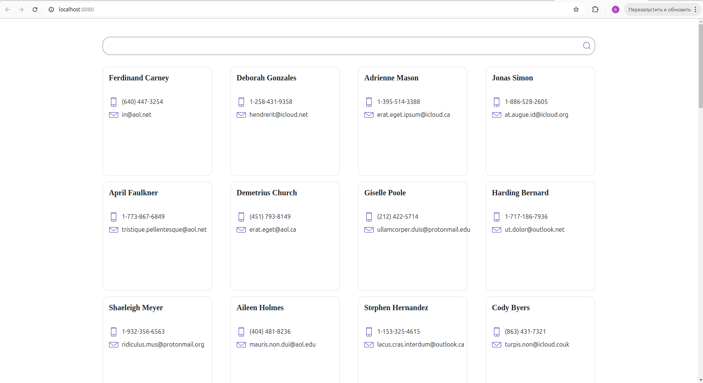
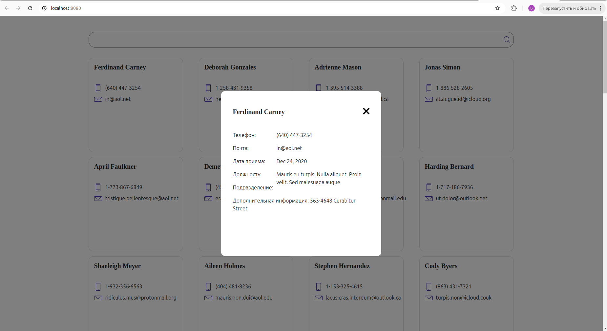
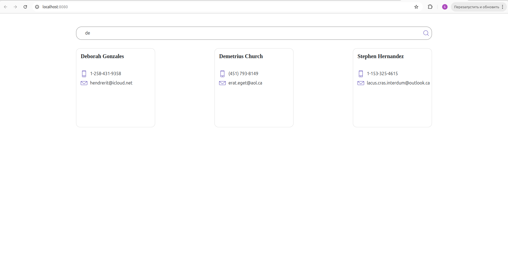

# Тестовое задание "Глобэкс АйТи"

### Installing

```
git clone https://github.com/bulat-nitaliev/globax_task.git
cd globax_task
```

запуск сервера

```
cd server
npm i
npm run start
```

запуск фронтенда

```
cd globax_task
npm i
npm run serve
```






